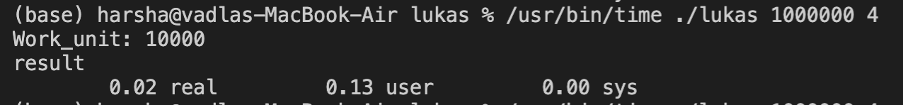

# Pony Actor Model Project

This project's objective is to identify all K consecutive integer sequences, starting at 1 or higher and going up to a maximum value of N, whose sum of squares equals a perfect square.

The boss splits the work into manageable bits and assigns workers to complete these portions.
This includes the entire amount of work that needs to be done, the number of groups, the actor's surroundings, and the outcome.

Work unit = Total items/ Total workers

This gives the work unit count that is the number of tasks given to each worker.

leftover work is the remaining work that need to be completed after distribution of tasks.

if worker count -> odd -> Results in leftover work

worker count -> Even -> Equal distribution of tasks

Then the boss creates a range of tasks and assign these to the workers.

For every group size it calculates the sum of squares for consecutive numbers. Then integer square root function is called to check if the sum is a perfect square.

The main actor initializes the program. First the control go to Boss which then executes steps as discussed above.

## Work Unit

In the program, the work unit size is calcul

Process of determining work unit in our program:

- We defined the number of worker actors to be **100**.

- The total number of sub-problems (N) is divided evenly among the workers. Each worker gets an equal portion of the work.

- If the total number of sub-problems (N) is not perfectly divisible by the number of workers, this leftover work is handled by assigning it to one of the workers.

- Once the work unit size is calculated, the Boss actor assigns each worker a range of sub-problems to each worker.

The size of the work unit that resulted in the best performance for our implementation is **10,000 sub-problems per worker request**.

## The result of running our program for lukas 1000000 4:

### MAC:

Here, Ratio (CPU time / Real-time): (0.13+0)/0.02 = 6.5

### WINDOWS:

## The largest problem we managed to solve( lukas 10000000000 20 ):

